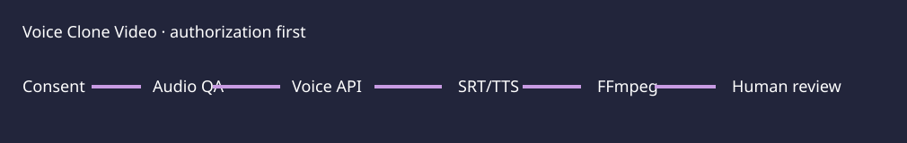
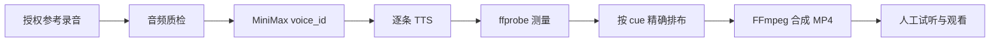

# Voice Clone Video



The [synthetic subtitle sample](examples/synthetic-subtitles.srt) contains no
real speaker or customer material. It can be used to inspect cue parsing and
timeline behavior without calling a voice provider.

> A lightweight, auditable voice-cloning and subtitle-dubbing workflow for WorkBuddy/Codex.

把一段经过明确授权的参考录音，变成可复用的 MiniMax `voice_id`，再逐条朗读
SRT/VTT 字幕，合成带新旁白的 MP4。它的定位不是一个笨重的桌面编辑器，而是一个
依赖面小、流程透明、方便接入个人工作流的语音视频工具。

## 中文说明

### 它解决什么问题

- 用一条命令完成“授权检查 → 录音质检 → 音色创建 → 逐条 TTS → 时间轴合成”。
- 每一条字幕 cue 对应一次 TTS 请求和一个独立音频片段，便于定位错读、重试和审计。
- 使用 Python 标准库 HTTP 客户端和本地 FFmpeg，不需要 Electron、Web 服务或数据库。
- 真实运行、离线 Mock、外部服务阻断和时间轴对齐失败都有明确状态，不把 Demo 当成真实效果。
- 默认不自动发布；输出完成后必须由人试听、观看并确认，再自行分享。

### 工作流



### 为什么它轻

| 层 | 选择 | 结果 |
| --- | --- | --- |
| 运行时 | Python 3.10+ 标准库 | 不维护大型依赖树 |
| 音视频 | 本地 FFmpeg / ffprobe | 处理逻辑可复现、方便检查 |
| 云端能力 | MiniMax API | 只在真实克隆和 TTS 时联网 |
| 交互方式 | CLI + JSON/Markdown 报告 | 可接入 WorkBuddy、Codex 或脚本流水线 |

### 快速开始

#### 1. 安装本地工具

- Python 3.10+
- `ffmpeg` 和 `ffprobe`
- MiniMax API Key（仅用于真实运行）

#### 2. 准备授权文件

复制模板并填写真实信息：

```bash
cp references/voice_consent_template.json /absolute/path/voice_consent.json
```

只有当声音所有者或其授权代表确认了这次具体用途后，才把
`consent_status` 改为 `APPROVED`。程序会拒绝缺少授权、过期或用途不匹配的文件。

#### 3. 配置你自己的 API Key

公开仓库只提供空模板。选择一种本地方式：

```bash
# 方式 A：复制为空壳模板，再只在本机填写
cp config.local.env.example config.local.env

# 方式 B：临时环境变量
export MINIMAX_API_KEY="your-own-key"

# 方式 C：macOS Keychain（推荐）
python scripts/configure_keychain.py
```

`config.local.env`、API Key、原始录音、授权证明和生成结果都已加入 `.gitignore`，
不要把它们提交到 GitHub。

#### 4. 运行完整流程

```bash
python scripts/run_voice_clone_video.py run \
  --audio /absolute/path/reference.m4a \
  --consent /absolute/path/voice_consent.json \
  --video /absolute/path/input.mp4 \
  --subtitles /absolute/path/input.srt \
  --output /absolute/path/run-output
```

### CLI 能力

只创建或复用音色：

```bash
python scripts/run_voice_clone_video.py clone \
  --audio /absolute/path/reference.m4a \
  --consent /absolute/path/voice_consent.json \
  --output runs/my-voice
```

使用已有 `voice_profile.json` 配音：

```bash
python scripts/run_voice_clone_video.py dub \
  --voice-profile runs/my-voice/voice_profile.json \
  --video /absolute/path/input.mp4 \
  --subtitles /absolute/path/input.srt \
  --output runs/my-video \
  --subtitle-mode mux
```

离线验证，不会调用 MiniMax：

```bash
python scripts/run_voice_clone_video.py run \
  --audio /absolute/path/reference.wav \
  --consent /absolute/path/approved-test-consent.json \
  --video /absolute/path/input.mp4 \
  --subtitles /absolute/path/input.srt \
  --output runs/mock \
  --mock
```

Mock 生成的是静音测试素材，结果始终标为 `DEMO_ONLY`，不能证明真实音色质量。

### 输出契约

| 文件 | 用途 |
| --- | --- |
| `voice_profile.json` | provider、`voice_id`、哈希和状态 |
| `voice_reference_report.json` | 参考录音的格式、时长和质量检查 |
| `audio_segments/` | 每条字幕 cue 对应的音频片段 |
| `narration_timeline.json` | 精确的开始、结束和测量时长 |
| `narration.wav` | 带静音间隔的旁白总轨 |
| `dubbed.srt` / `dubbed.ass` | 重新生成的字幕文件 |
| `dubbed.mp4` | 替换旁白后的成片 |
| `run_report.md` | 状态、证据、警告和下一步人工动作 |

### 状态与人工边界

- `WAITING_CONSENT`：授权信息不完整或尚未批准。
- `VOICE_REFERENCE_QUALITY_INSUFFICIENT`：参考录音不可用。
- `VOICE_READY`：音色已创建，可以进入配音阶段。
- `BLOCKED_EXTERNAL`：MiniMax 或外部依赖不可用。
- `BLOCKED_SEGMENT_AUDIO_ALIGNMENT`：音频片段超出 cue 时间窗或发生重叠。
- `VIDEO_READY_FOR_REVIEW`：视频已渲染，但仍必须人工试听和观看。
- `DEMO_ONLY`：离线 Mock，只是软件测试证据。

### 安全和隐私

本项目只适用于得到明确授权的声音。禁止用于冒充、诈骗、身份验证、OTP/账号找回、
政治劝诱、金融或医疗欺骗，或任何让受众误以为是真人本人发声的高风险场景。

录音在真实运行时会上传给 MiniMax 声音克隆接口。请在上传前确认声音所有者、用途、
平台和保存期限；在需要披露的场景中标明这是 AI 生成的声音。仓库不包含任何真实 Key、
身份证明、原始授权材料、原始音频或生成媒体。

### 验证

```bash
python -m unittest discover -s tests -p 'test_*.py'
python scripts/validate_run.py --skill-dir .
```

当前测试覆盖授权门禁、字幕时间轴、离线 Mock 端到端合成和公开包结构检查。

### 项目结构

```text
.
├── README.md
├── SKILL.md
├── config.local.env.example
├── references/voice_consent_template.json
├── scripts/
│   ├── audio_qa.py
│   ├── configure_keychain.py
│   ├── minimax_client.py
│   ├── run_voice_clone_video.py
│   ├── subtitle_timeline.py
│   ├── validate_run.py
│   └── video_mux.py
└── tests/
```

### 路线图

1. 增加更多 TTS provider adapter，同时保持统一的时间轴和报告格式。
2. 增加更细的音频质量回归样本和字幕边界案例。
3. 在不牺牲人工审核的前提下，补充可选的本地 Web UI。

## English

Voice Clone Video is a small, auditable CLI workflow for authorized voice cloning
and subtitle-timed video dubbing. It uses a dependency-free Python HTTP client,
MiniMax for real voice operations, and local FFmpeg for media assembly.

Core guarantees:

- consent is required before any real voice upload;
- one subtitle cue maps to one TTS request and one measured audio segment;
- API keys and private media stay local and are ignored by Git;
- mock runs are labelled `DEMO_ONLY`;
- the workflow stops at `VIDEO_READY_FOR_REVIEW` and never auto-publishes.

See the Chinese quick start above for commands and output details.

## License status

The incoming archive did not include a license file. The repository is public, but
no new license is asserted here. Add the license that matches your ownership and
the upstream project's rights before accepting external contributions.
